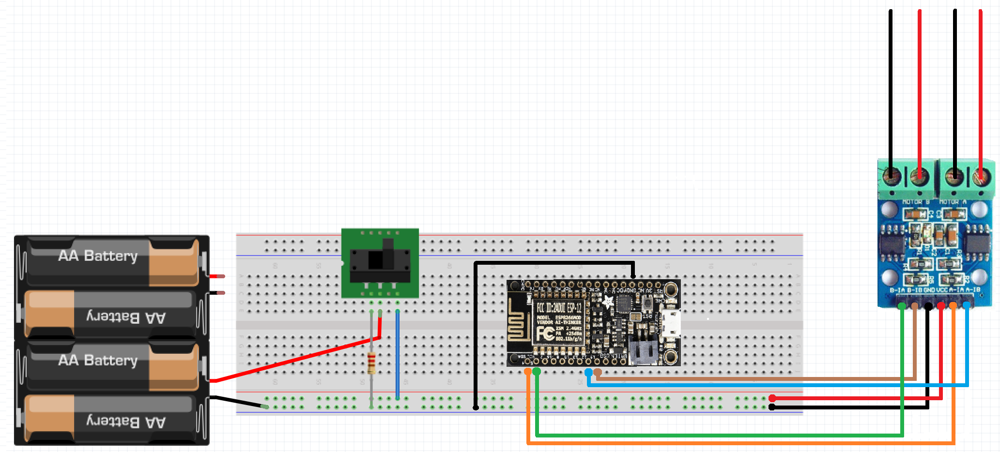

# Feather HUZZAH NodeBot

Put Javascript on a Feather because... Javascript!

# Software requirements
 - [Arduino IDE](https://www.arduino.cc/en/Main/Software), v. 1.6.4 or greater
 - [git](https://git-scm.com/)
 - [node](https://nodejs.org/en/) with npm v3 or greater
 - [USB driver installer](https://www.silabs.com/products/mcu/Pages/USBtoUARTBridgeVCPDrivers.aspx) for your OS

# Instructions

## Setting up the Feather HUZZAH with Johnny-Five and WiFi communication
 7. [Download](https://www.silabs.com/products/mcu/Pages/USBtoUARTBridgeVCPDrivers.aspx) and install the USB driver for your OS. Mac users: See note below.
 8. Open the Arduino IDE and choose Preferences. Find the Additional Board Manager URLs field and enter the following URL: ``http://arduino.esp8266.com/stable/package_esp8266com_index.json``.
 9. In Tools > Board > Board Manager, search for ESP8266 and install the corresponding package.
 10. In Tools > Board, select Adafruit HUZZAH.
 11. Open terminal and run ``git clone https://github.com/firmata/arduino.git ~/Documents/Arduino/libraries/Firmata``. Once this is  complete, restart the Arduino IDE.
 12. In File > Examples > Firmata, select StandardFirmataWifi. You'll need to make a few changes to this code.
   - Line 85 of StandardFirmataWifi.ino: uncomment define SERIAL_DEBUG.
   - Line 119 of wifiConfig.h: Set char ssid[] to the name of the WiFi (SSID) you want to connect to.
   - Line 151 of wifiConfig.h: Set wpa_passphrase to the password of the WiFi you want to connect to. Ensure that lines 148-151 are not commented out.
 13. Select File > Save As and save your firmware with a new name like StandardFirmataWifi-NodeBots. Plug in the board and ensure that the correct COM port for your device is selected under Tools > Port.
 14. Click the verify button in the Arduino IDE (checkmark on the top left toolbar). Once your code is verified, upload it by clicking the right arrow button. Once you see that the code has been uploaded 100%, you are good to go!
 15. You can now disconnect the Feather from computer and attach USB power bank to micro USB port on the Feather.
 - (Note for Mac OS X: The USB driver installation process was a little tricky--I ended up running the installer, then navigating to the folders created by it, finding the OS X folders, and running another installer inside there. The Arduino IDE didn't recognize the COM port at first. I tried a combination of restarting the machine with the device plugged in, changing ports, and changing cables 'til it just worked, but it wasn't clear what exactly was the magic combination that got it up and running. You can see some debugging information [here](http://community.silabs.com/t5/Interface-Knowledge-Base/Troubleshooting-the-CP210x-USB-to-UART-Bridge-VCP-Drivers-on-a/ta-p/159012). If you are unable to get this working on a Mac, see if you can borrow a PC for a bit--you only need to flash the device once.)
 
## Downloading the code to control your bot from the command line
 10. Clone this repo to your local machine (``git clone https://github.com/hxlnt/feather-nodebot.git``).
 11. Then, ``cd feather-nodebot``
 12. Then, ``npm install``
 
## Registering your device on RoboWriter, the
 13. ``npm install -g iothub-explorer``
 14. ``iothub-explorer login "HostName=huzzahbots.azure-devices.net;SharedAccessKeyName=iothubowner;SharedAccessKey=SHARED_ACCESS_KEY_GOES_HERE"`` (Replace ``SHARED_ACCESS_KEY_GOES_HERE`` with the shared access key provided to you separately.)
 15. ``iothub-explorer create my-cool-device-name --connection-string`` where ``my-cool-device-name`` is whatever you want your device to be called. Take note of this name as well as the primary key returned back from the command line tool.
 16. Update index.js to contain your device's ID (name), primary key, and IP address (from Step 2 above).
 
## Wire up the bot

.JPG)

1. Assemble the chassis kit. *Hint: You can bend the red and black motor wire ends into hooks that will stay on the motors without solder for testing purposes.*
2. Affix the free ends of the motor wires to the screw terminals in the H-bridge (red-black-red-black). Feed the wires through the holes in the chassis to secure them.
3. Gently plug the Feather board into the breadboard.
4. Attach six female-male jumper wires to the other end of the H-bridge. Connect the two pins labeled motor A to the Feather's pin 4 and pin 12. Connect the two pins labeled motor B to the Feather's pin 5 and pin 14. Connect H-bridge GND to the ground rail of the breadboard. Connect H-bridge VCC to the power rail of the breadboard. 
5. Use a male-male jumper to connect the breadboard ground rail to the GND pin of the Feather.
6. Add 4 AA batteries to the battery holder and plug the red wire into the power rail and the black wire into the ground rail. *Hint: You might want to leave the red wire unplugged until you're ready to drive the car in lieu of an on/off switch..*
7. *Optional: Add an on/off switch to your bot by following the circuit diagram below.*
8. Use a ziptie to hold the breadboard, battery pack, and USB charger (to be plugged in later) to the chassis platform.


 
## Drive your bot all around town!
 17. ``node index.js``
 18. You should see an output similar to this one upon a successful connection:
```
1481283325844 Device(s) Firmata
1481283345878 Connected Firmata
1481283369317 Repl Initialized
>> STAHP
Client connected
```
Inside the Node.js command prompt, use the keyboard keys up, right, and left to drive the car. Press the space bar to stop the car. Press q to quit.

## Coming soon: Link to the Azure IoT dashboard, where you can see a visualization of the motion and stats of all cars.
